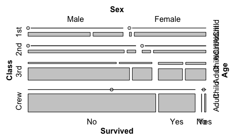
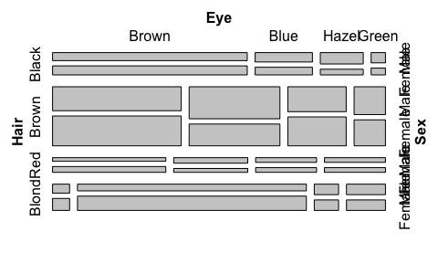

In order to get the most out of the workshop, please install the
following or update to the latest version in advance.

**RColorBrewer** (1.1-2)

**tidyverse** (1.3.0)

**vcd** (1.4-8)

Next please run the following code examples to make sure the above
packages are working. The graphs shown below should appear.

``` r
library(vcd)
```

    ## Loading required package: grid

``` r
mosaic(Titanic)
```

<!-- -->

``` r
mosaic(HairEyeColor)
```

<!-- -->

Don’t hesitate to contact us in advance if you have any questions:

Joyce Robbins <jtr13@columbia.edu>

Ludmila Janda <ludmila.janda@gmail.com>

best, Joyce and Ludmila
